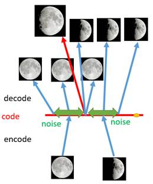
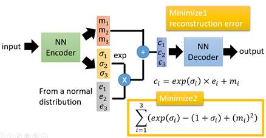
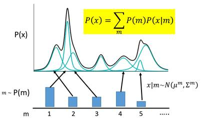
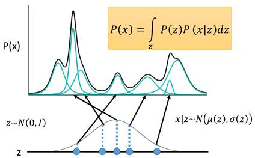
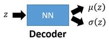
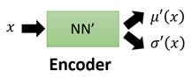

## VAE 原理概述

VAE的终极目的，是 input(图片) -> latent(隐变量) -> output(图片).图片能够编码成易于表示的形态，并且这一形态能够尽可能无损地解码回原真实图像

其中遇到的一个问题是，即使我们的训练数据具备了几个点，但是这些点是离散的，无法表示连续的分布。因此我们通过加入噪声来模拟连续的分布。

***

具体来说，通过NN生成两个权重，一个是原有编码m_i,一个是噪声的权重编码$\sigma_i$，通过正态分布$e_i$与$\sigma_i$相乘，得到混合噪声，再与原有编码相加，得到最终编码$c_i$。

$$
c_i = m_i + \sigma_i * e_i
$$

但是如果loss只有这个，那么噪声权重会趋向于0，那么就退化成了普通的编码器。因此还需要引入一个重构损失  
，避免这种情况。  
$exp(\sigma_i) - (1+\sigma_i) ,\sigma_i处取得最小值$

## 公式推导

离散情况很好理解  

VAE 能够表示为 多个不同分布高斯混合模型，其中 P(m)表示混合模型中第 m 个高斯分布的权重，根据权重决定，P(x|m)表示第 m 个高斯分布的分布概率(正态分布)。

$$
P(x) = \sum_{m} P(m)P(x|m)
$$

表示成连续的函数

$$
    P(x) = \int_{z} P(z)P(x|z) 
$$

其中z ~ N(0,1) , x|z ~ N($\mu(z), \sigma(z)$),实际上需要求解的就是$\mu(z), \sigma(z)$，代表着每个高斯混合模型的分布。由于P(x)的复杂，导致难以求解，引入两个NN来帮助.

第一个NN是decoder，它求解的是μ和σ两个函数，这等价于求解P(x|z)，因为x|z ~ N(μ(z),σ(z))。

第二个神经网络叫做Encoder，它求解的结果是$q(z|x)$,q可以代表任何分布。

这里引入第二个神经网络是为了辅助第一个Decoder求解$P(x|z)$

